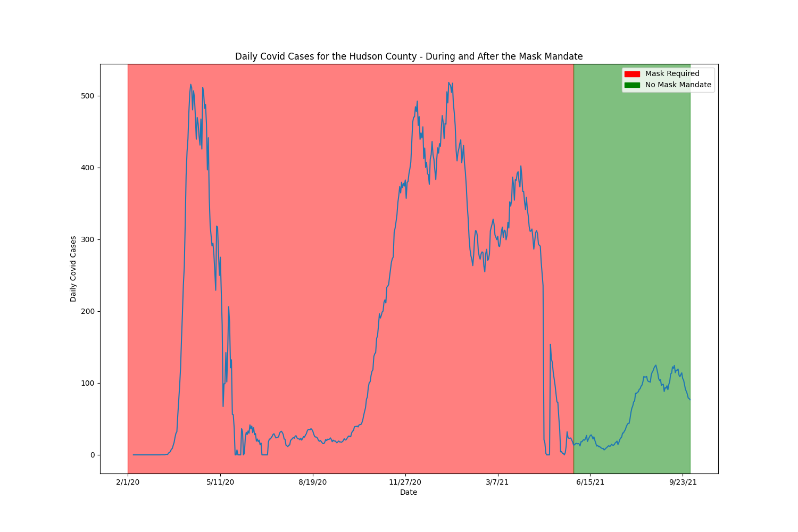

# Professionalism & Reproducibility

**DATA 512: Human-Centered Data Science**

**Course Project**

**Part 1 - Common Analysis**

### Goal:
During the last three years we all have been experiencing a global pandemic. This has been tragic and disruptive to many countries and has taken a deep personal toll on many individuals and their families.
One aspect that has been hard to miss in the last three years is the datafication of the pandemic. That is, many aspects of the individual toll of the pandemic have been collected, aggregated and re-represented as data. This datafication gives us the privilege to examine the pandemic from potentially many different perspectives to understand how it has changed lives and how it has changed society. To be honest, we are actually at the very beginning of understanding and comprehending these impacts.
During this Course Project you are going to begin taking a look at some of the social aspects of the pandemic by conducting a human centered data science analysis of some available COVID-19 data. In Part 1- Common Analysis, every student in the course will work from the same datasets. Students will be assigned to analyze data for one specific County of the United States.

#### Assigned County: Hudson, New Jersey 

### Data Sources:
- [John Hopkins University COVID-19 data](https://www.kaggle.com/datasets/antgoldbloom/covid19-data-from-john-hopkins-university).
- [Masking Mandates by County](https://data.cdc.gov/Policy-Surveillance/U-S-State-and-Territorial-Public-Mask-Mandates-Fro/62d6-pm5i)
- [Mask Compliance Survey](https://github.com/nytimes/covid-19-data/tree/master/mask-use)

### Input Data Files
- Data/RAW_us_confirmed_cases.csv
- Data/mask-mandate.csv
- Data/mask-use-by-county.csv

### Data Description for RAW_us_confirmed_cases.csv

| Feature        | Data type | Description                                                         |
|----------------|-----------|---------------------------------------------------------------------|
| Province_State | String    | The name of state                                                   |
| Admin2         | String    | The name of the county                                              |
| UID            | int       | Unique ID of the county                                             |
| Country Region | String    | The country that the county belongs to                              |
| Lat            | float     | The county latitude                                                 |
| Long_          | float     | The county longitude                                                |
| Combined Key   | String    | Unique key by combining the county, state and country               |
| \<date>        | int       | Confirmed number of cases for each day from 1/22/2020 to 10/30/2022 |

### Final Visualization:

